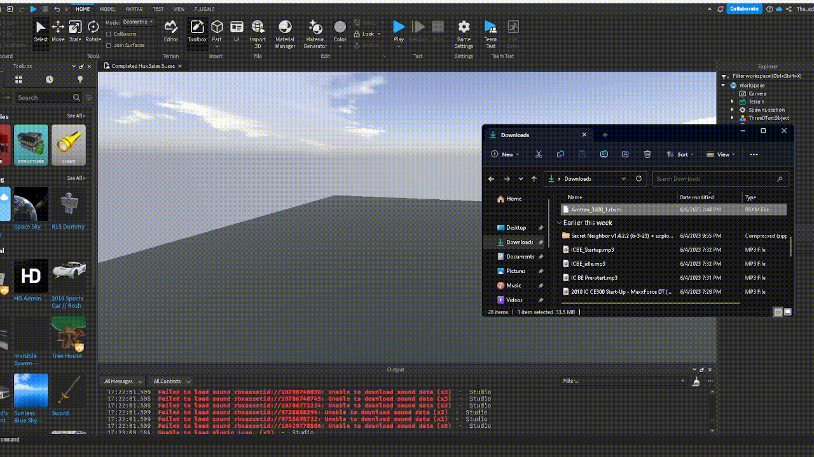

You may be asking,

How do I import the BUS-NAME.rbxm file into studio?

Well there are two methods!

## 1st Method

In a baseplate/your game, **right click workspace**. A drop down should appear.

Following that, click **insert from file**.

## 2nd Method

In a baseplate/your game, keep the studio window open,
Open your folder where the .rbxm file is and drag it into your window as shown below

**You've imported your .rbxm file!**
